## Introduction to Android App Development

Android app development is the process of creating applications that run on the Android operating system, developed by Google. These apps can run on smartphones, tablets, smart TVs, and other Android-powered devices.

Android apps are built using specific tools, programming languages, and frameworks provided in the Android ecosystem.

### Advantages of Developing Android Apps

1. Wide User Base
   Android is the most widely used mobile OS globally.
   Millions of potential users across different devices.

2. Open Source Platform
   Android is based on open-source technologies.
   Developers have flexibility to customize apps.

3. Multiple Distribution Channels
   Apps can be distributed via:
   Google Play Store
   Third-party app stores
   Direct APK sharing

4. Rich Development Tools
   Official support from Google
   Powerful IDE and libraries

5. High Customization
   UI/UX can be fully customized
   Supports different screen sizes and devices

6. Monetization Opportunities
   Ads, subscriptions, in-app purchases
   
### Tools Used in Android Development
1. Android Studio
   Official IDE for Android development
   Developed by Google
   Features:
   Code editor with smart suggestions
   Emulator for testing apps
   Built-in debugging tools
   Drag-and-drop UI designer

### Programming Languages for Android
1. Kotlin (Recommended)

   Official language for Android development

   Fully supported by Google


## Android Activities
### What is an Activity?
An Activity is a single screen in an Android.

It represents what the user sees and interacts with

Think of an Activity as a page in a book

Each page (Activity) has its own content and layout

#### App Demo

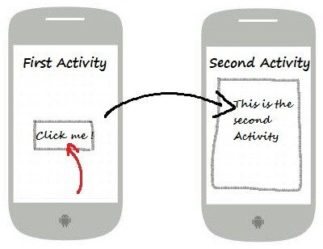

This means if you are developing an app, you will have many Pages, Right? this simply means you will have many ACTIVITIES.

### Follow these steps to create your first Android app:

#### Step 1: Open Android Studio

Launch Android Studio

#### Step 2: Click "File Menu"  then "New Project"

Choose "Empty Views Activity"

#### Step 3: Configure Your Project


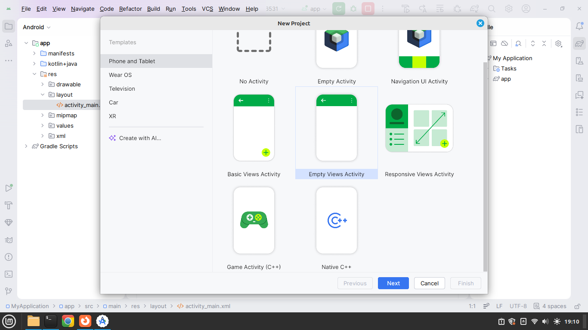


### Fill in the following:

Name: Your app name (e.g., Class_WellnessApp)

Package Name: com.example.myfirstapp

Save Location: Choose folder

Language: Select Kotlin

Minimum SDK: Choose API level (e.g., API 21+)

Step 4: Click "Finish"

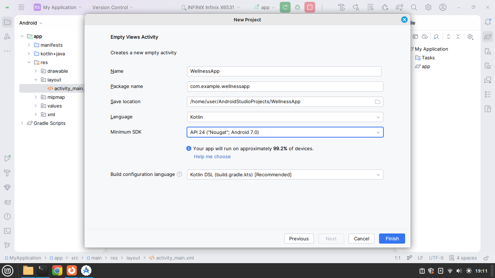

### Android Studio will:

Set up project structure

Download dependencies

Build your app

### Project Structure Overview

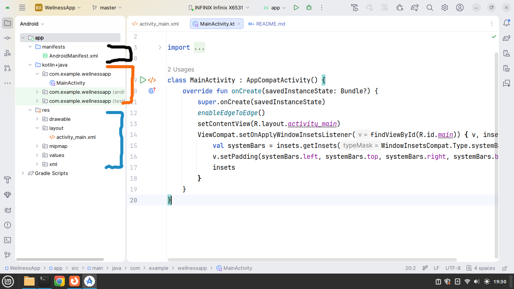

### Explanation
The image shows a part covered in;

1. Black line(Android Manifest)
2. Orange - Kotlin
3. Blue - XML


#### More explanations;

MainActivity.kt → Main logic of the app -  inside SRC

activity_main.xml → UI layout - inide res folder

AndroidManifest.xml → App configuration -  inside app 

Gradle Scripts → Dependency management - inside app.


### Lets briefly customize the app we created before running in our phones!

In your app, navigate to res Folder -> layout -> Open activity_main.xml

This File is where your UI/User Interface is created, We use a language known as XML , Its a markup language that uses tags like HTML

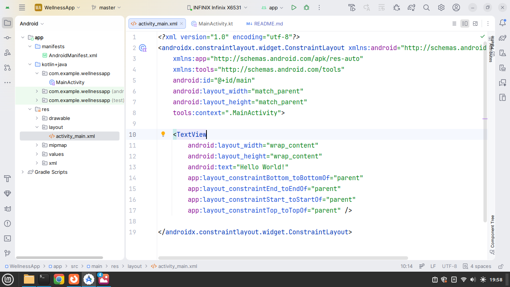

Now, we want to change the background color of our app, in above code we see the whole code is enclosed in a Constraint layout

ConstraintLayout is the main container (layout) of your app screen.

It helps you position items anywhere on the screen.

Think of it as a board where you place your components.

xmlns:android - This tells Android: “I am using standard Android features” like texts, widths, height etc.

android:id="@+id/main"    - gives our layout a unique identification

android:layout_width="match_parent"  - specifies the layout width to fill entire width

android:layout_height="match_parent" - specifies the layout height to fill entire height

tools:context=".MainActivity" - “This layout belongs to MainActivity” a kotlin file located in src

To change background color, add below code to your ConstraintLayout.

```xml
  android:background="#448AFF"
```
Above code changes the Layout background to #448AFF cutomize to your color, check more on https://m2.material.io/design/color/the-color-system.html

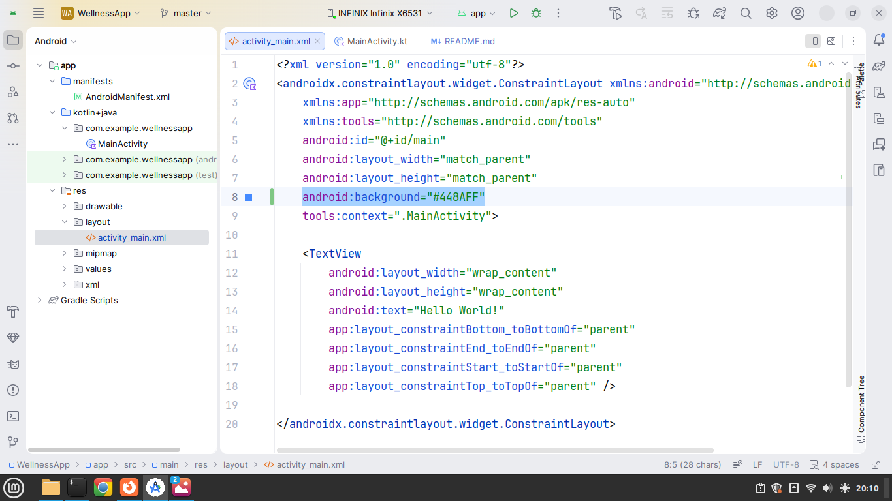

Switch from code to UI using icons sourrounded in red in below image


#### TODO XML in detail in Chapter 2


### Running Your App
### Option 1: Emulator

Built-in virtual Android device in Android Studio

### Option 2: Physical Device

Enable Developer Options

Turn on USB Debugging

Connect phone via USB

### Summary

Android development allows you to build apps for millions of users.

Android Studio is the main tool.

Kotlin is the preferred language.

Apps are built using Activities, Intents, and XML layouts.


## Chapter 2
### XML vs Kotlin in Android Development

When building Android apps in Android Studio, you use two main parts:

### 1. XML → The User Interface (What the User Sees)
XML (eXtensible Markup Language) is used to design the layout of your app.(Same family with HTML)

### It controls:

Text on the screen

Buttons

Images

Arrangement of elements

### Simple Example (XML Layout)
```xml
   <TextView
       android:id="@+id/textView"
       android:layout_width="wrap_content"
       android:layout_height="wrap_content"
       android:text="Hello Student!" />
   
   <Button
       android:id="@+id/button"
       android:layout_width="wrap_content"
       android:layout_height="wrap_content"
       android:text="Click Me" />
```

### Explanation:

TextView → Displays text

Button → A clickable button

XML only shows them, it does NOT control logic, like what to do when clicked , touched etc

Above XML would display the TextView and Button as below

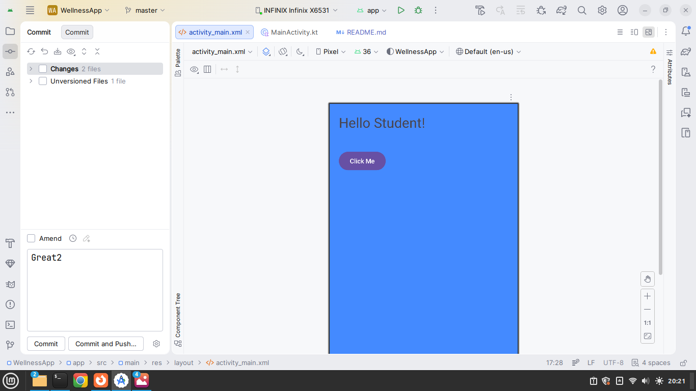


## Views in Android
### What is a View?

In Android, a View is any element that you can see on the screen.

Examples:
Text

Buttons

Images

A View = a building block of the user interface (UI)

### Common Types of Views in Android
1. TextView – Displays text on the screen.
2. Button – Clickable element for actions.
3. ImageView – Displays images or icons.
4. EditText – Lets the user input text.
5. CheckBox – Allows multiple selections.
6. RadioButton – Allows single selection from a group.
7. Switch – Toggle between on/off states.
8. ProgressBar – Shows progress of tasks.
9. SeekBar – Slider for selecting values.
10. Spinner – Drop-down menu for choosing options.
11. ListView – Displays a scrollable list of items.
12. RecyclerView – Advanced, efficient list for large data.
13. WebView – Displays web pages inside the app.
14. etc.

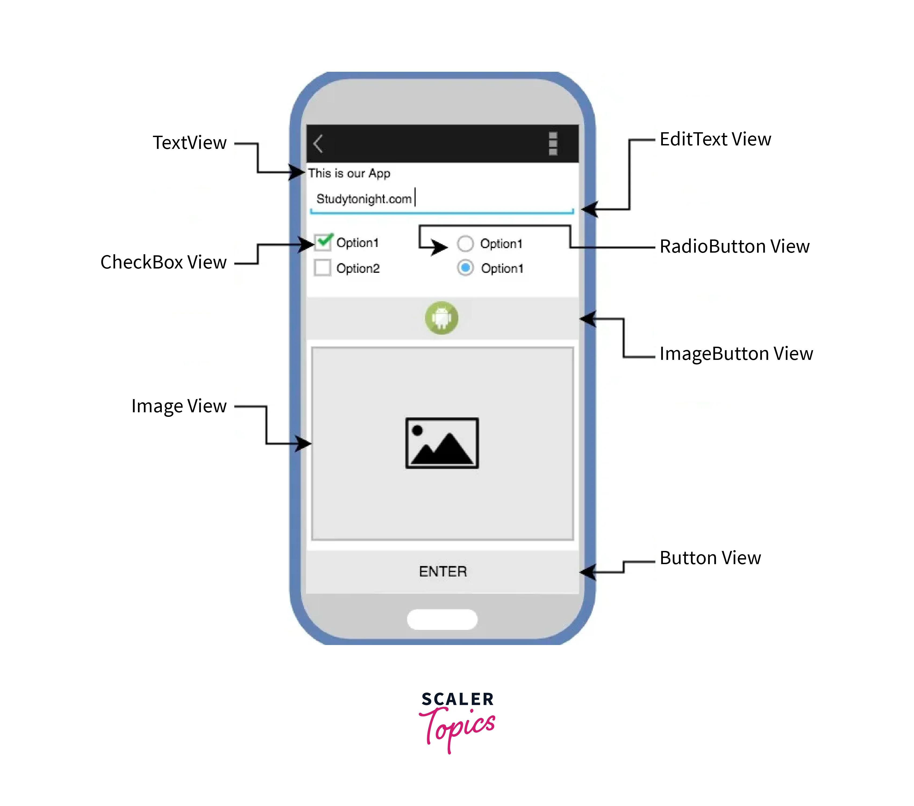


## What is a ViewGroup?

A ViewGroup is a special type of View that holds other Views (or ViewGroups).

Think of it as a container or layout.

It organizes how child Views appear on the screen.

Examples: arranging buttons, text, and images.

### Example:
Views = furniture (chair, table, TV)

ViewGroup = the room holding the furniture.

### Common ViewGroups in Android

LinearLayout – Arranges child Views in a single row or column (horizontal or vertical).

ConstraintLayout – Flexible layout that positions Views relative to each other or the parent, ideal for complex designs.

ScrollView – Makes its child scrollable vertically (or horizontal with HorizontalScrollView).

GridLayout – Arranges child Views in a grid of rows and columns.

TableLayout – Organizes Views in table-like rows and columns.

CoordinatorLayout – Special layout for coordinating animations or interactions (used with Material Design).

RecyclerView – Advanced container for efficiently displaying large scrollable lists.

A ViewGroup is responsible for containing and arranging multiple View objects within it. It acts as a container for other Views, allowing you to create user interfaces for android

### An Example of LinearLayout View Group

```xml
   <LinearLayout
       xmlns:android="http://schemas.android.com/apk/res/android"
       android:layout_width="match_parent"
       android:layout_height="match_parent"
       android:orientation="vertical">
   
       <TextView
           android:layout_width="wrap_content"
           android:layout_height="wrap_content"
           android:text="Hello Student!" />
   
       <Button
           android:layout_width="wrap_content"
           android:layout_height="wrap_content"
           android:text="Click Me" />
   
   </LinearLayout>
```

Above shows a LinearLayout ViewGroup holding two views namely TextView and Button.
The LinearLayout has a property orientation that makes the views inside it, show vertically.

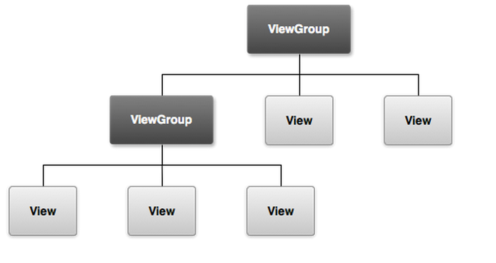

Now that we know what are Views and ViewGroup, Lets now understand common properties using in views

### Common Properties of Android Views

Every View in Android has some basic properties that control its size, appearance, and behavior.

1. android:id
   Gives a unique name to the View
   Used to reference it in Kotlin

2. android:layout_width & android:layout_height
   Control the size of the View
   Common values:
   wrap_content → size fits the content
   match_parent → fills the available space

3. android:text
   Text displayed by Views like TextView or Button

4. android:hint
   Placeholder text in EditText fields

5. android:src
   Image source for ImageView

6. android:background
   Sets background color or image

7. android:visibility
   Controls if the View is visible, invisible, or gone.

8. android:padding
   Space inside the View (between content and border)

9. android:margin
   Space outside the View (distance from other Views).

10. android:textSize
    Changes text size.

## Chapter 3
In this chapter, we will use XML to design the user interface (UI) for a simple Health and Wellness App.
The app will help users understand:

Health Information

Wellness Information

Simple interactive elements like buttons and text.

XML will be used for what the user sees.

So, Open your XML Code under res->layout->activity_main.xml

Below is your current XML code.

```xml
<?xml version="1.0" encoding="utf-8"?>
   <androidx.constraintlayout.widget.ConstraintLayout xmlns:android="http://schemas.android.com/apk/res/android"
           xmlns:app="http://schemas.android.com/apk/res-auto"
           xmlns:tools="http://schemas.android.com/tools"
           android:id="@+id/main"
           android:layout_width="match_parent"
           android:layout_height="match_parent"
           android:background="#448AFF"
           tools:context=".MainActivity">
   
      <TextView
              android:layout_width="wrap_content"
              android:layout_height="wrap_content"
              android:text="Hello World!"
              app:layout_constraintBottom_toBottomOf="parent"
              app:layout_constraintEnd_toEndOf="parent"
              app:layout_constraintStart_toStartOf="parent"
              app:layout_constraintTop_toTopOf="parent" />
   
   </androidx.constraintlayout.widget.ConstraintLayout>
```
Next, we will add new Views and ViewGroups, here, we create TextViews to display health and wellness information.
Add Buttons for user interaction and navigation.

So we change the Constraint Layout to Linear Layout to allow views arrangement on screen.
modify your code as shown below.

```xml
<?xml version="1.0" encoding="utf-8"?>
<LinearLayout xmlns:android="http://schemas.android.com/apk/res/android"
        xmlns:app="http://schemas.android.com/apk/res-auto"
        xmlns:tools="http://schemas.android.com/tools"
        android:id="@+id/main"
        android:layout_width="match_parent"
        android:layout_height="match_parent"
        android:background="#448AFF"
        android:orientation="vertical"
        tools:context=".MainActivity">
   

</LinearLayout>
```

Above image, we have changed the Layout to Linear, added an Orientation property in the Linear Layout.
We have also removed the TextView View. So we have an empty Linear Layout(It's a ViewGroup).

### Now inside the LinearLayout, we add 

1. TextView  - For App heading
2. ImageView - For Displaying a from Image
3. Buttons - To provide users withoption to click on a Button and navigate on another screen


Add below TextView

```xml
  <TextView
        android:layout_width="match_parent"
        android:layout_height="wrap_content"
        android:text="Health and Wellness"
        android:textSize="30sp"
        android:padding="20dp"
        android:textAlignment="center"
        android:textStyle="bold"
        android:layout_marginTop="30dp"
        android:textColor="#ffffff"
/>
```

### Explanation of Attributes

android:layout_width="match_parent" → TextView stretches across the full width of the screen

android:layout_height="wrap_content" → Height adjusts automatically to fit the text

android:text="Health and Wellness" → The text displayed

android:textSize="30sp" → Makes the text large and readable

android:padding="20dp" → Adds space inside the TextView (around the text)

android:textAlignment="center" → Centers the text horizontally

android:textStyle="bold" → Makes the text bold

android:layout_marginTop="30dp" → Adds space above the TextView from other elements

android:textColor="#ffffff" → Makes the text white


### Full Code 
```xml
<?xml version="1.0" encoding="utf-8"?>
<LinearLayout xmlns:android="http://schemas.android.com/apk/res/android"
        xmlns:app="http://schemas.android.com/apk/res-auto"
        xmlns:tools="http://schemas.android.com/tools"
        android:id="@+id/main"
        android:layout_width="match_parent"
        android:layout_height="match_parent"
        android:background="#448AFF"
        android:orientation="vertical"
        tools:context=".MainActivity">

   <TextView
           android:layout_width="match_parent"
           android:layout_height="wrap_content"
           android:text="Health and Wellness"
           android:textSize="30sp"
           android:padding="20dp"
           android:textAlignment="center"
           android:textStyle="bold"
           android:layout_marginTop="30dp"
           android:textColor="#ffffff"
   />
   
   
</LinearLayout>

```

#### Output

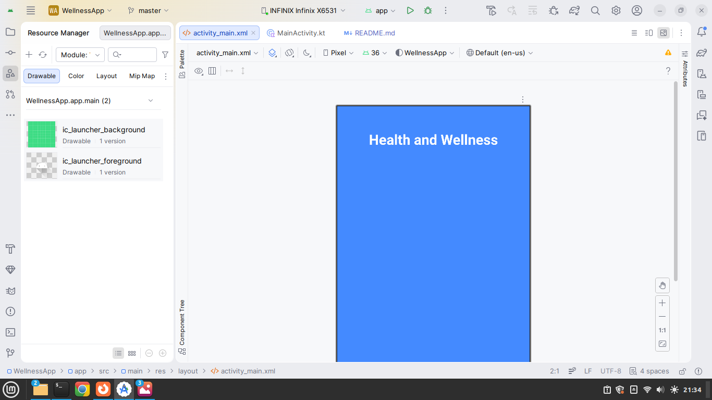


#### Add an ImageView

First copy and paste provided images in res-drawable folder

#### Add an ImageView

```xml
    <ImageView
        android:layout_width="match_parent"
        android:layout_height="wrap_content"
        android:src="@drawable/image2"
        android:layout_margin="10dp"
        android:scaleType="fitCenter"/>
```
Above ImageView, we specify the width and height, then we load the image we pasted in drawable, we make the image fit properly at the center.  

#### Add Buttons, Below is an example of one button UI.

```xml
     <Button
        android:layout_width="match_parent"
        android:layout_height="wrap_content"
        android:text="Healthy Recipes"
        android:layout_margin="10dp"
        android:id="@+id/healthy_tips"/>
```


### Full XML Code

```xml
<?xml version="1.0" encoding="utf-8"?>
<LinearLayout xmlns:android="http://schemas.android.com/apk/res/android"
        xmlns:app="http://schemas.android.com/apk/res-auto"
        xmlns:tools="http://schemas.android.com/tools"
        android:id="@+id/main"
        android:layout_width="match_parent"
        android:layout_height="match_parent"
        android:background="#448AFF"
        android:orientation="vertical"
        tools:context=".MainActivity">

   <TextView
           android:layout_width="match_parent"
           android:layout_height="wrap_content"
           android:text="Health and Wellness"
           android:textSize="30sp"
           android:padding="20dp"
           android:textAlignment="center"
           android:textStyle="bold"
           android:layout_marginTop="30dp"
           android:textColor="#ffffff"
   />

   <ImageView
           android:layout_width="match_parent"
           android:layout_height="wrap_content"
           android:src="@drawable/image2"
           android:layout_margin="10dp"
           android:scaleType="fitCenter"/>

   <Button
           android:layout_width="match_parent"
           android:layout_height="wrap_content"
           android:text="Healthy Recipes"
           android:layout_margin="10dp"
           android:id="@+id/healthy_recipes"/>

   <Button
           android:layout_width="match_parent"
           android:layout_height="wrap_content"
           android:text="Nutrition Advice"
           android:layout_margin="10dp"
           android:id="@+id/nutrition_advice"/>

   <Button
           android:layout_width="match_parent"
           android:layout_height="wrap_content"
           android:text="Meditation"
           android:layout_margin="10dp"
           android:id="@+id/meditation"/>

   <Button
           android:layout_width="match_parent"
           android:layout_height="wrap_content"
           android:text="Hydration Alert"
           android:layout_margin="10dp"
           android:id="@+id/hydration_alert"/>

   <Button
           android:layout_width="match_parent"
           android:layout_height="wrap_content"
           android:text="Start Exercise"
           android:layout_margin="10dp"
           android:id="@+id/start_exercise"/>

   <Button
           android:layout_width="match_parent"
           android:layout_height="wrap_content"
           android:text="Daily Motivation"
           android:layout_margin="10dp"
           android:id="@+id/daily_motivation"/>

   <Button
           android:layout_width="match_parent"
           android:layout_height="wrap_content"
           android:text="Weekly Goals"
           android:layout_margin="10dp"
           android:id="@+id/weekly_goals"/>

   <Button
           android:layout_width="match_parent"
           android:layout_height="wrap_content"
           android:text="Check Progress"
           android:layout_margin="10dp"
           android:id="@+id/wcheck_progress"/>


</LinearLayout>
```

### Running Your App
#### Option 1: Emulator

Built-in virtual Android device in Android Studio

#### Option 2: Physical Device

Enable Developer Options

Turn on USB Debugging

Connect phone via USB

### Output

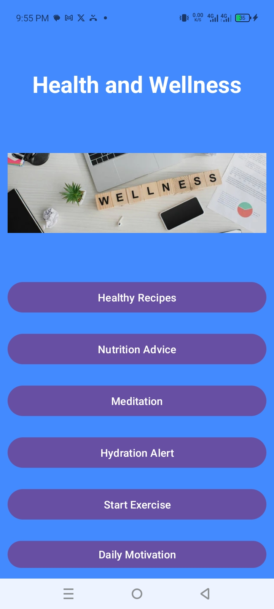

Since we have several buttons, they might extend outiside the screen height being invisible to users this depends on screen size of the smartphone you are using, users might need to scroll up and down for that reason we need to wrap our Views with a ScrollView.

Wrap your Views with a ScrollView, First lets look at ScrollView Syntax

```xml
 <ScrollView
        android:layout_width="match_parent"
        android:layout_height="match_parent">
        
        //Other Views Goes here
</ScrollView>
```

#### Full Code activity_main.xml
```xml
<?xml version="1.0" encoding="utf-8"?>
<ScrollView
    xmlns:android="http://schemas.android.com/apk/res/android"
    xmlns:app="http://schemas.android.com/apk/res-auto"
    xmlns:tools="http://schemas.android.com/tools"
    android:layout_width="match_parent"
    android:layout_height="match_parent">
<LinearLayout 
    android:id="@+id/main"
    android:layout_width="match_parent"
    android:layout_height="match_parent"
    android:background="#448AFF"
    android:orientation="vertical"
    tools:context=".MainActivity">
    
        
    <TextView
        android:layout_width="match_parent"
        android:layout_height="wrap_content"
        android:text="Health and Wellness"
        android:textSize="30sp"
        android:padding="20dp"
        android:textAlignment="center"
        android:textStyle="bold"
        android:layout_marginTop="30dp"
        android:textColor="#ffffff"
        />

    <ImageView
        android:layout_width="match_parent"
        android:layout_height="wrap_content"
        android:src="@drawable/image2"
        android:layout_margin="10dp"
        android:scaleType="fitCenter"/>

     <Button
         android:layout_width="match_parent"
         android:layout_height="wrap_content"
         android:text="Healthy Recipes"
         android:layout_margin="10dp"
         android:id="@+id/healthy_recipes"/>

    <Button
        android:layout_width="match_parent"
        android:layout_height="wrap_content"
        android:text="Nutrition Advice"
        android:layout_margin="10dp"
        android:id="@+id/nutrition_advice"/>

    <Button
        android:layout_width="match_parent"
        android:layout_height="wrap_content"
        android:text="Meditation"
        android:layout_margin="10dp"
        android:id="@+id/meditation"/>

    <Button
        android:layout_width="match_parent"
        android:layout_height="wrap_content"
        android:text="Hydration Alert"
        android:layout_margin="10dp"
        android:id="@+id/hydration_alert"/>

    <Button
        android:layout_width="match_parent"
        android:layout_height="wrap_content"
        android:text="Start Exercise"
        android:layout_margin="10dp"
        android:id="@+id/start_exercise"/>

    <Button
        android:layout_width="match_parent"
        android:layout_height="wrap_content"
        android:text="Daily Motivation"
        android:layout_margin="10dp"
        android:id="@+id/daily_motivation"/>

    <Button
        android:layout_width="match_parent"
        android:layout_height="wrap_content"
        android:text="Weekly Goals"
        android:layout_margin="10dp"
        android:id="@+id/weekly_goals"/>

    <Button
        android:layout_width="match_parent"
        android:layout_height="wrap_content"
        android:text="Check Progress"
        android:layout_margin="10dp"
        android:id="@+id/wcheck_progress"/>
    
 
</LinearLayout>
</ScrollView>

```

### Explanation
In Above Code, we have a ScrollView as the main ViewGroup to enable scrolling capabilities.

Then we have a LinearLayout that specifies the Views arrangement - Vertical in this case, Inside the Linear Layout, We put our Views.

Now if you run the application, you will be able to have a Scrolling Up and down capabilities.

Below screenshot shows scrolling has been enabled by addng a ScrollView ViewGroup.

### Output after scrollview implementation

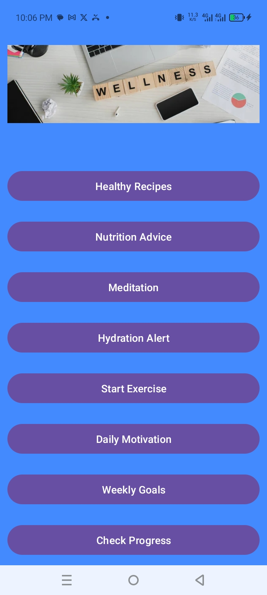

## Chapter 4

### What is an Intent?

An Intent is like a messenger in Android that tells the app to do something or go somewhere.

Example: When a user clicks a button, the app can open another screen using an Intent.

Button click.
Intent = Go to another screen

## Two Types of Intents

### Explicit Intent
Tells Android exactly which Activity (screen) to open
Example: Clicking “Start Exercise” button → Opens ExerciseActivity.

### Implicit Intent
Android decides which app or activity can handle the action
Example: Clicking a “Share” button → Opens a list of apps (WhatsApp, Email, etc.)

### Focus in This Chapter: Explicit Intents
When the user clicks a button, they are taken to a specific screen or Activity

### Visual Explanation of Explicit Intents

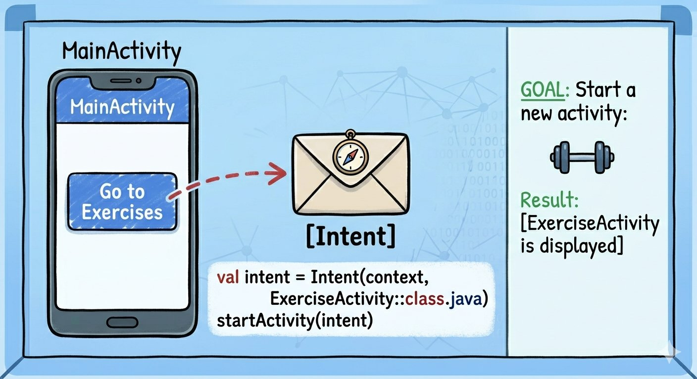

#### We start with Explicit intents.


Our aim is, if a user clicks any of above Buttons, we navigate to another Activity(Page). To do that we use Explicit Intents

First we need to create activities to navigate to when button are clicked, 

Let's create 2 different Activities -> to be used by above first 2 buttons.

#### How to create a New Activity

Right Click on app, Click New - Activity - Empty Views Activity.

You will see below Screen, change the Activity Name to 'HealthyRecipes', Please observe that there is a corresponding Layout for that Activity you created.

Then click Finish.

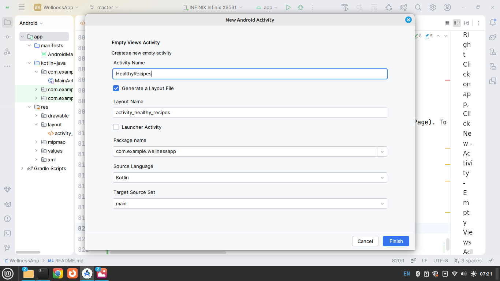

Check your app File Structure and Notice that a New Activity hass been Created and an XML.

### Let's create another Activity.

Right Click on app, Click New - Activity - Empty Views Activity.

You will see below Screen, change the Activity Name to 'NutritionAdvice', Please observe that there is a corresponding Layout for that Activity you created.

Then click Finish.

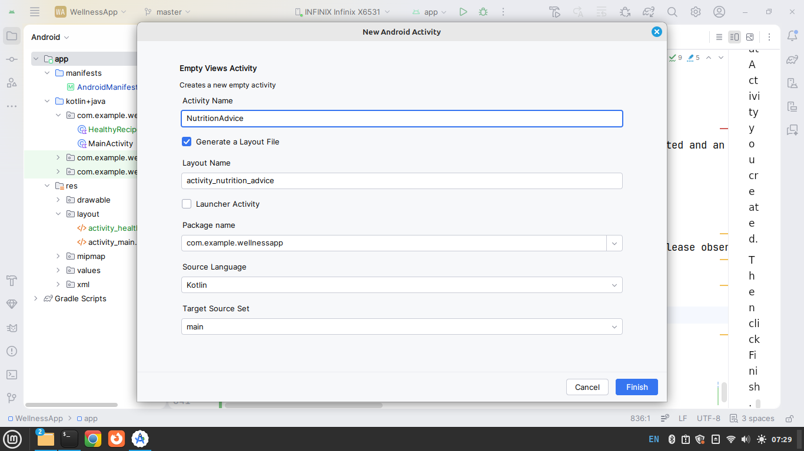

Now, below screenshot shows the 2 additional activities and their corresponding layouts
Activities(Kotlin Files) are highlighted in Red and Layouts are highlighted in Blue.

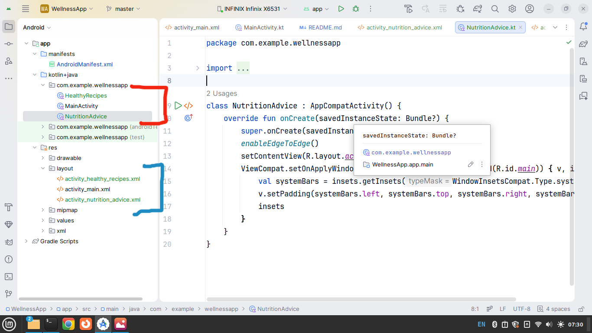

You can and open them and notice they are basically empty.

### Performing Explicit Intent
As mentioned earlier Explitit Intents are ued to Navigate from one Activity to Another, In our application we have 3 Different Activity namely MainActivity, HealthyRecipes and NutritionAdvice.

Then we can proceed to Naviagate among the Activity using Explicit Intents

#### Open, res-> layout-> activity_main.xml


```xml
<?xml version="1.0" encoding="utf-8"?>
<ScrollView
        xmlns:android="http://schemas.android.com/apk/res/android"
        xmlns:app="http://schemas.android.com/apk/res-auto"
        xmlns:tools="http://schemas.android.com/tools"
        android:layout_width="match_parent"
        android:layout_height="match_parent">
   <LinearLayout
           android:id="@+id/main"
           android:layout_width="match_parent"
           android:layout_height="match_parent"
           android:background="#448AFF"
           android:orientation="vertical"
           tools:context=".MainActivity">


      <TextView
              android:layout_width="match_parent"
              android:layout_height="wrap_content"
              android:text="Health and Wellness"
              android:textSize="30sp"
              android:padding="20dp"
              android:textAlignment="center"
              android:textStyle="bold"
              android:layout_marginTop="30dp"
              android:textColor="#ffffff"
      />

      <ImageView
              android:layout_width="match_parent"
              android:layout_height="wrap_content"
              android:src="@drawable/image2"
              android:layout_margin="10dp"
              android:scaleType="fitCenter"/>

      <Button
              android:layout_width="match_parent"
              android:layout_height="wrap_content"
              android:text="Healthy Recipes"
              android:layout_margin="10dp"
              android:id="@+id/healthy_recipes"/>

      <Button
              android:layout_width="match_parent"
              android:layout_height="wrap_content"
              android:text="Nutrition Advice"
              android:layout_margin="10dp"
              android:id="@+id/nutrition_advice"/>

      <Button
              android:layout_width="match_parent"
              android:layout_height="wrap_content"
              android:text="Meditation"
              android:layout_margin="10dp"
              android:id="@+id/meditation"/>

      <Button
              android:layout_width="match_parent"
              android:layout_height="wrap_content"
              android:text="Hydration Alert"
              android:layout_margin="10dp"
              android:id="@+id/hydration_alert"/>

      <Button
              android:layout_width="match_parent"
              android:layout_height="wrap_content"
              android:text="Start Exercise"
              android:layout_margin="10dp"
              android:id="@+id/start_exercise"/>

      <Button
              android:layout_width="match_parent"
              android:layout_height="wrap_content"
              android:text="Daily Motivation"
              android:layout_margin="10dp"
              android:id="@+id/daily_motivation"/>

      <Button
              android:layout_width="match_parent"
              android:layout_height="wrap_content"
              android:text="Weekly Goals"
              android:layout_margin="10dp"
              android:id="@+id/weekly_goals"/>

      <Button
              android:layout_width="match_parent"
              android:layout_height="wrap_content"
              android:text="Check Progress"
              android:layout_margin="10dp"
              android:id="@+id/wcheck_progress"/>


   </LinearLayout>
</ScrollView>
```

Observe that all Buttons have an id, if NOT please add ID properties.

Let's work with first 2 Buttons.

They have ids android:id="@+id/healthy_tips"  and android:id="@+id/nutrition_advice"
PLEASE CONFIRM.

Now, Go to MainActivity under kotlin + java Folder.

#### You have;

  ```kotlin
package com.example.wellnessapp

class MainActivity : AppCompatActivity() {
   override fun onCreate(savedInstanceState: Bundle?) {
      super.onCreate(savedInstanceState)
      enableEdgeToEdge()
      setContentView(R.layout.activity_main)
      ViewCompat.setOnApplyWindowInsetsListener(findViewById(R.id.main)) { v, insets ->
         val systemBars = insets.getInsets(WindowInsetsCompat.Type.systemBars())
         v.setPadding(systemBars.left, systemBars.top, systemBars.right, systemBars.bottom)
         insets
      }
   }
}

 ```

### 🔹 class MainActivity : AppCompatActivity()

This creates your main screen (Activity) of the app.
Think of an Activity as a single page/screen in your Android app.

### 🔹 override fun onCreate(savedInstanceState: Bundle?)

This function runs when the app starts.
It’s where you set up everything for your screen.

### 🔹 setContentView(R.layout.activity_main)

This connects your Kotlin code to your XML layout (UI design).
It displays what you designed in activity_main.xml.

### 🔹 enableEdgeToEdge()

Allows your app to use the full screen, even behind system bars (like status bar).

### 🔹 ViewCompat.setOnApplyWindowInsetsListener(...)

This part makes sure your app content doesn’t get hidden behind system bars.

It gets the space used by system bars (top, bottom, sides)
Then adds padding so your UI stays visible

### Summary:
MainActivity → your app screen.

onCreate() → runs when app opens.

setContentView() → shows your UI.

Insets code → keeps UI properly spaced on screen


After the Insets code, we need to find the Buttons from our XML file. Why? Those buttons dont have any logic they were just displayed to the user, its time to use Kotlin and apply some logic them.

### Which Logic are we Adding?

#### TODO.
1. Find the Buttons by ID inside MainActivity.
2. Add a ClickLitener to the Buttons - Makes button Clickable
3. Put an Explicit Intent to Respective activities.


So, add below code after the insets Code.

We start finding the two first buttons.

```kotlin
  val healthy_recipes = findViewById<Button>(R.id.healthy_recipes)
```

This line is used to connect a button from your screen (XML) to your Kotlin code.
### Break it down:

#### val healthy_recipes

Creates a variable to store the button

--->  You’ll use this name to control the button in code

#### findViewById<Button>(...)

Finds the button from your layout

---> <Button> tells Android it is a Button

#### R.id.healthy_recipes

This is the ID of the button you gave in XML

Then add a ClickListener to the Button above

```kotlin
    healthy_recipes.setOnClickListener{
        //TODO Intent Navigation Here
    }
```

Above code , set a Clicklistener to the button

Then inside the Listener, we can put our Explicit Intent to Navigate to HealthyRecipes Activity

```kotlin
   val intent = Intent(applicationContext, HealthyRecipes::class.java)
   startActivity(intent)
```

### What it means:
#### 🔹 Intent(...)

An Intent is like a message telling Android:

--- > “Open another screen (Activity)”

#### 🔹 Intent(applicationContext, HealthyRecipes::class.java)

1. applicationContext → where the request is coming from

2. HealthyRecipes::class.java → the screen you want to open

---> So this says:
“From this app, open the HealthyRecipes screen.”

### Full MainActivity Code.

```kotlin
package com.example.wellnessapp

class MainActivity : AppCompatActivity() {
   override fun onCreate(savedInstanceState: Bundle?) {
      super.onCreate(savedInstanceState)
      enableEdgeToEdge()
      setContentView(R.layout.activity_main)
      ViewCompat.setOnApplyWindowInsetsListener(findViewById(R.id.main)) { v, insets ->
         val systemBars = insets.getInsets(WindowInsetsCompat.Type.systemBars())
         v.setPadding(systemBars.left, systemBars.top, systemBars.right, systemBars.bottom)
         insets
      }

      //find Buttons by IDs
      val healthy_recipes = findViewById<Button>(R.id.healthy_recipes)
      healthy_recipes.setOnClickListener{
         val intent = Intent(applicationContext, HealthyRecipes::class.java)
         startActivity(intent)
      }//end 


      

   }
}
```

Let's do for the second button, we repeat the same procedure.

```kotlin
package com.example.wellnessapp

class MainActivity : AppCompatActivity() {
   override fun onCreate(savedInstanceState: Bundle?) {
      super.onCreate(savedInstanceState)
      enableEdgeToEdge()
      setContentView(R.layout.activity_main)
      ViewCompat.setOnApplyWindowInsetsListener(findViewById(R.id.main)) { v, insets ->
         val systemBars = insets.getInsets(WindowInsetsCompat.Type.systemBars())
         v.setPadding(systemBars.left, systemBars.top, systemBars.right, systemBars.bottom)
         insets
      }

      //find Buttons by IDs
      //First button
      val healthy_recipes = findViewById<Button>(R.id.healthy_recipes)
      healthy_recipes.setOnClickListener{
         val intent = Intent(applicationContext, HealthyRecipes::class.java)
         startActivity(intent)
      }//end 

      //Second button
      val nutrition_advice = findViewById<Button>(R.id.nutrition_advice)
      nutrition_advice.setOnClickListener{
         val intent = Intent(applicationContext, NutritionAdvice::class.java)
         startActivity(intent)
      }//end 


   }
}

```

Above, we find the first 2 buttons, set click listener and Navigate to respective screens/activities using an Expliocit Intent

### Running Your App

### Option 1: Emulator

Built-in virtual Android device in Android Studio

### Option 2: Physical Device

Enable Developer Options

Turn on USB Debugging

Connect phone via USB

### Output.
Click any of the First 2 Buttons and Watch the Intent Working as shown below

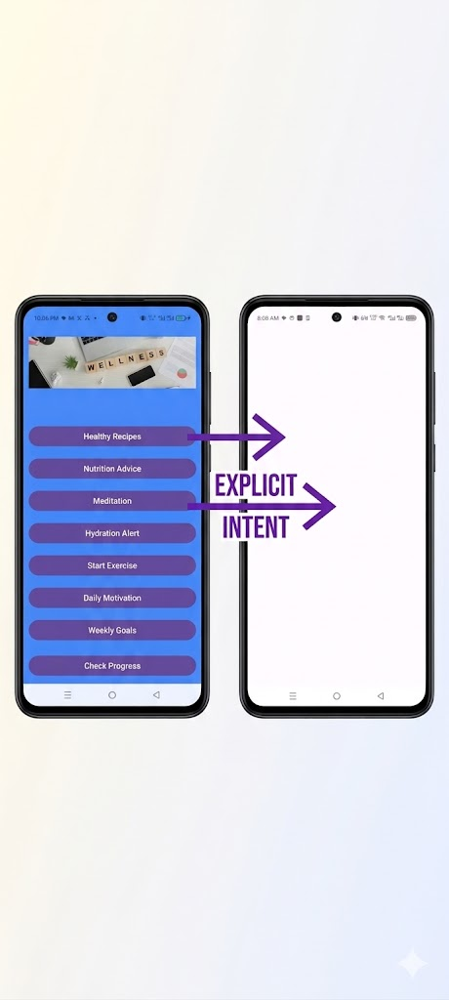

### NB: You can do the same for other Buttons.

## Chapter 5
In this chapter, we will add content to the empty Activities that we already created and linked using Intents.

Before this, our Activities (screens) were empty — they existed, but had no text, images, or useful information.

#### Now, we will:

Design the screens using XML layouts

Add text, images, and buttons

Make each screen meaningful and useful to the user.

Open activity_healthy_recipes.xml, this is where we create content ot information that the users will see.
Currently, you have;

activity_healthy_recipes.xml

```xml
<?xml version="1.0" encoding="utf-8"?>
<androidx.constraintlayout.widget.ConstraintLayout xmlns:android="http://schemas.android.com/apk/res/android"
        xmlns:app="http://schemas.android.com/apk/res-auto"
        xmlns:tools="http://schemas.android.com/tools"
        android:id="@+id/main"
        android:layout_width="match_parent"
        android:layout_height="match_parent"
        tools:context=".HealthyRecipes">

</androidx.constraintlayout.widget.ConstraintLayout>
```

Change to LinearLayout, add orientation to vertical, so our views will be vertically aligned

```xml
<?xml version="1.0" encoding="utf-8"?>
<LinearLayout xmlns:android="http://schemas.android.com/apk/res/android"
        xmlns:app="http://schemas.android.com/apk/res-auto"
        xmlns:tools="http://schemas.android.com/tools"
        android:id="@+id/main"
        android:layout_width="match_parent"
        android:layout_height="match_parent"
        android:orientation="vertical"
        tools:context=".HealthyRecipes">

</LinearLayout>
```


Now we add and imageView and Textviews to show Texts description

### Below is Updated XML for recipes.

```xml
<?xml version="1.0" encoding="utf-8"?>
<LinearLayout xmlns:android="http://schemas.android.com/apk/res/android"
        xmlns:app="http://schemas.android.com/apk/res-auto"
        xmlns:tools="http://schemas.android.com/tools"
        android:id="@+id/main"
        android:layout_width="match_parent"
        android:layout_height="match_parent"
        android:orientation="vertical"
        tools:context=".HealthyRecipes">


   <TextView
           android:layout_width="match_parent"
           android:layout_height="wrap_content"
           android:text="Healthy Recipes"
           android:textSize="30sp"
           android:padding="20dp"
           android:textColor="#536DFE"
           android:textStyle="bold"
   />

   <ImageView
           android:layout_width="match_parent"
           android:layout_height="wrap_content"
           android:src="@drawable/image6"
           android:scaleType="centerCrop"/>


   <TextView
           android:id="@+id/recipesText"
           android:layout_width="match_parent"
           android:layout_height="wrap_content"
           android:text="Healthy Recipes\n\n1. Fruit Salad\nA mix of fresh fruits like bananas, apples, and oranges.\n\n2. Grilled Chicken\nLow-fat grilled chicken served with vegetables.\n\n3. Vegetable Stir Fry\nCarrots, broccoli, and peppers cooked lightly.\n\n4. Oatmeal Breakfast\nOats with milk and fruits.\n\n5. Avocado Toast\nWhole grain bread topped with avocado.\n\n6. Boiled Eggs\nRich in protein and easy to prepare.\n\n7. Smoothie Bowl\nBlended fruits with yogurt and nuts.\n\n8. Brown Rice and Beans\nHealthy and full of fiber.\n\n9. Baked Fish\nFish baked with lemon and spices.\n\n10. Greek Yogurt with Honey\nGood for digestion and very nutritious."
           android:textSize="16sp"
           android:padding="16dp"/>


</LinearLayout>
```


### This XML designs a Healthy Recipes screen in your app.

#### 🔹 LinearLayout
This is the main container
orientation="vertical" → items are arranged top to bottom.

#### 🔹 First TextView (Title)
android:text="Healthy Recipes"

Displays the title of the screen

textSize="30sp" → makes it big

textStyle="bold" → makes it bold

textColor → gives it a nice color

---> This is the heading

#### 🔹 ImageView
android:src="@drawable/image6"

Displays an image from your drawable folder

scaleType="centerCrop" → fills the space nicely

--->This adds visual appeal

#### 🔹 Second TextView (Content)
Shows the list of healthy recipes

Uses \n to create new lines

textSize="16sp" → normal readable text

padding="16dp" → adds space around text

---> This is the main content

### Simple Summary:

LinearLayout → arranges everything vertically

TextView (top) → title

ImageView → shows image

TextView (bottom) → recipe details

### Run Your App 

When user clicks on the First button, it moves to Recipe Activity, See below.

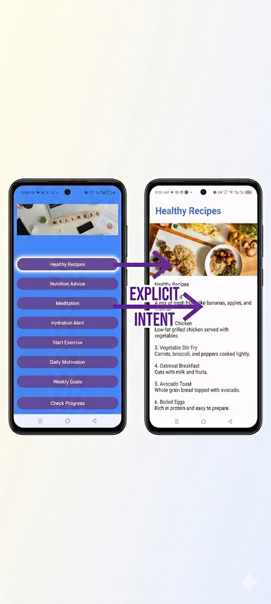

## NEXT -> 
1. TODO Other Activities and their Contents.
2. Add Monetization - Ads
3. Customize
4. Publish on App Store


## Monetization

### What is Ads Monetization?

Ads monetization is the process of earning money by displaying ads in your mobile app.

### Developers earn when users:

1. View ads (impressions)
2. Click ads
3. Watch ads (videos)

### Popular Ad Networks

Google AdMob (Most popular)
Meta Audience Network

### Google Admob.
### What is Google AdMob?

Google AdMob is a platform by Google that allows app developers to earn money by displaying ads in mobile apps.

It connects your app to advertisers, and you get paid when users interact with ads.


You create an app

You add ads using AdMob

Advertisers pay Google

Ads appear in your app

You earn money


## Types of Ads in AdMob
### 🟩 Banner Ads
Small ads at top or bottom
Always visible
Easy to implement
Moderate earnings

### 🟦 Interstitial Ads
Full-screen ads

Shown between activities

Higher earnings

### 🟨 Rewarded Ads
Users watch ads voluntarily

You give rewards (coins, hints, unlocks)

Higher earnings

## Example
### Banner Ad

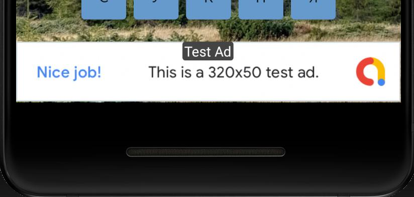
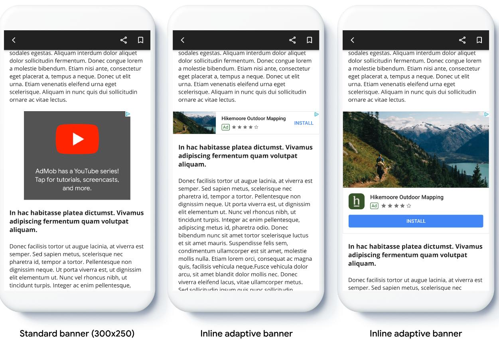

### Interstitial Ads

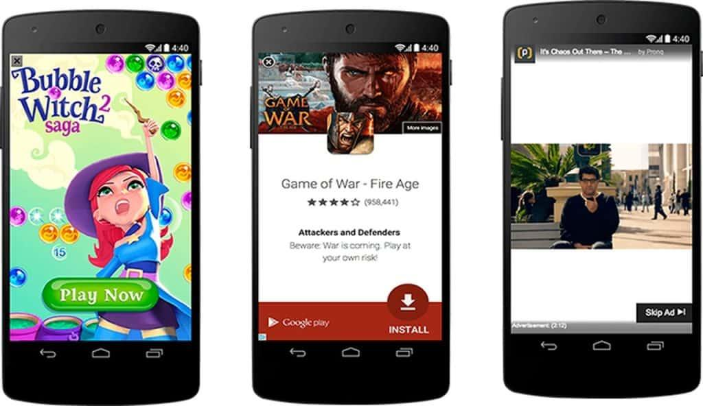

### Rewarded Ads

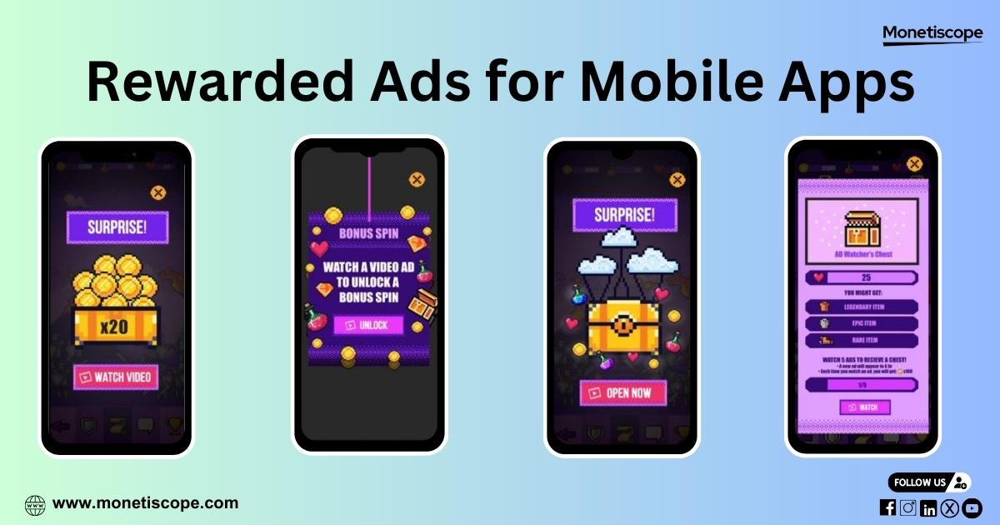


### Admob Payment Flow


## Admob Implementation in Android


## Steps to Add Ads (AdMob)
### Step 1: Create Account

Go to AdMob website  - admob.google.com/

Create an app.
### Get:
App ID, Ad Unit ID.

#### Check Video explaining steps to create account, add app, create ad units .... at the end of this repo..

FOR NOW, we will use testing IDs, Since we are testing ads, then later go live.
USE BELOW FOR TESTING.

App ID: ca-app-pub-3940256099942544~3347511713

Ad Unit ID: Banner Ads - ca-app-pub-3940256099942544/6300978111

Ad Unit ID: Interstitial Ads - ca-app-pub-3940256099942544/1033173712

Ad Unit ID : Rewarded Ads- ca-app-pub-3940256099942544/5224354917

### Step 2: Add Dependency
In gradle (app), add below dependency for enabling admob usage in yout app 

```gradle
   implementation 'com.google.android.gms:play-services-ads:23.0.0'
```
 Sync your app for above added dependency to take effect.

### Step 3: Add App ID (AndroidManifest.xml)
In Android Manifest add below line, Add it inside the <application> tag. In the value attribute add the App_ID we got in Step 1
```xml
<meta-data
    android:name="com.google.android.gms.ads.APPLICATION_ID"
    android:value="ca-app-pub-xxxxxxxx~xxxxxxxx"/>
```
#### See below

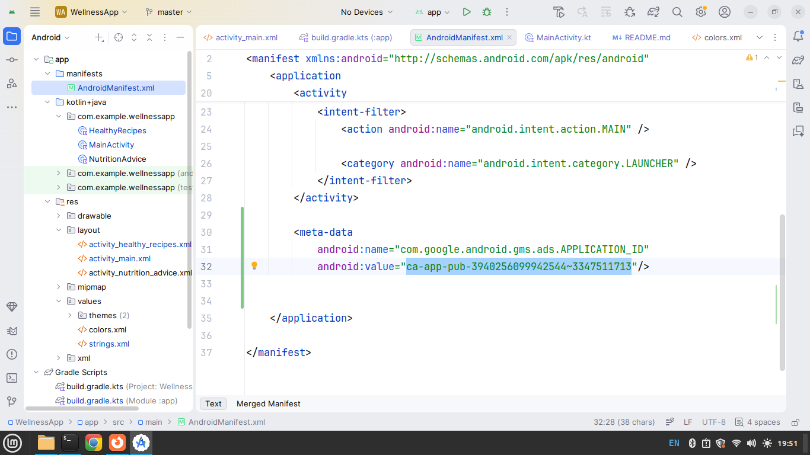

### 1. Banner Add Placement
Let's begin by placing a Banner Ad, in any XML Layout(i will use activity_main.xml in this case.).
Place below adView, Its a View you can placed before the first button, below our image
Place the Ad Unit ID as shown below.

```xml
 <com.google.android.gms.ads.AdView
        android:id="@+id/adView"
        android:layout_width="match_parent"
        android:layout_height="wrap_content"
        app:adSize="BANNER"
        app:adUnitId="ca-app-pub-3940256099942544/6300978111"/>

```

Then in Kotlin - MainActivity
Implement the Banner ad using below code. Add the code Just below(...  setContentView(R.layout.activity_main))

```kotlin
        MobileAds.initialize(this)
        val adView = findViewById<AdView>(R.id.adView)
        val adRequest = AdRequest.Builder().build()
        adView.loadAd(adRequest)
```

Explanation
### a) MobileAds.initialize(this)
Starts the Google AdMob SDK

Prepares your app to load ads

Must be called before showing ads

### b) val adView = findViewById<AdView>(R.id.adView)
Get the AdView from Layout

Connects your Kotlin code to the ad view in XML

R.id.adView = the banner ad you placed in your layout

### c) val adRequest = AdRequest.Builder().build()
Creates a request asking AdMob for an ad

You can customize it (e.g., test devices)

### d) adView.loadAd(adRequest)
Load the Ad

Sends the request to AdMob

AdMob returns an ad

The ad is displayed in your app

NB: Check that below imports have been imported.

```code
import com.google.android.gms.ads.MobileAds
import com.google.android.gms.ads.AdRequest
import com.google.android.gms.ads.AdView
import com.google.android.gms.ads.*
```
Finally Add internet permissions in AndroidManifest.xml, Place this code outside the application tag.

```xml
   <uses-permission android:name="android.permission.INTERNET"/>
```

#### Run your app -> Make sure you are connected to the internet.

Observe the test add as shown below.

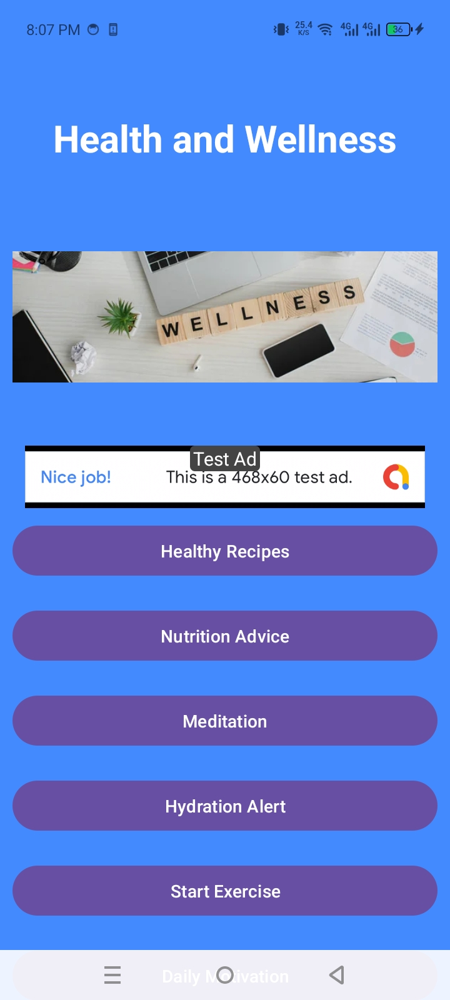

#### NB: We are using test ads since our app is yet to be published on any app store.
#### Once app is published, it will serve real ads and you start earning.

### 2. Interstitial Add Placement
In this step, we now learn how to implement interstitial ads, Unlike Banner ads that occupy a small portion in your layout, Interstitial ads blcok the whole screen.
### Implementation

In MainActivity, declare below variable Globally (Inside our MainActivity Class, but Outside a functions). This variable will hold our add later, for now lets leave initialized to 'null'
```kotlin
    private var mInterstitialAd: InterstitialAd? = null
```

Add below 2 functions in MainActivity, add them after oncreate function.
Note, that we provide interstitial ad, Test ID, Below code is used to Load an Interstitial add that blocks the whole screen.
There are 2 functions implement that detects on Failure of ad or successfully loaded
```kotlin
   
    fun loadInterstitialAd() {
        val adRequest = AdRequest.Builder().build()
        //Requests interstitial ads
        InterstitialAd.load(
            this,
            "ca-app-pub-3940256099942544/1033173712", // Test ID
            adRequest,
            object : InterstitialAdLoadCallback() {

                override fun onAdLoaded(ad: InterstitialAd) {
                    mInterstitialAd = ad
                }

                override fun onAdFailedToLoad(error: LoadAdError) {
                    mInterstitialAd = null
                }
            }
        )
    }
    //Function checks if ad already running not to run anothet one and overlap - which is wrong
    fun showInterstitialAd() {
        if (mInterstitialAd != null) {
            mInterstitialAd?.show(this)
        }
    }
```

Then confirm below imports have been imported.

```code
   import com.google.android.gms.ads.interstitial.InterstitialAd
   import com.google.android.gms.ads.interstitial.InterstitialAdLoadCallback
```

Now that we have the code, how do we call our two functions were created??

First, inside onCreate function where the app loads, Load interstitial ad.
Note below is inside, OnCreate.
```kotlin
    showInterstitialAd()
```

Now your onCreate should look omething like;
```kotlin
   override fun onCreate(savedInstanceState: Bundle?) {
        super.onCreate(savedInstanceState)
        enableEdgeToEdge()
        setContentView(R.layout.activity_main)

        //Initialize Admob ads
        MobileAds.initialize(this)
        
        //Load Banner ad
        val adView = findViewById<AdView>(R.id.adView)
        val adRequest = AdRequest.Builder().build()
        adView.loadAd(adRequest)

        //Load Interstitial ad
        loadInterstitialAd()  //HERE *******************

         //Other codes
```


Now that we have loaded an ready to show interstitial ads, The next quesstion is at what point do we show them??

In this case, i will how an interstitial(Full Screen ad) at navigation , where user is linking form one activity to another,

So, in MainActivity, locate healthyrecipes button after or before intent call  showInterstitialAd() function

```kotlin
  //find Buttons by IDs
        val healthy_recipes = findViewById<Button>(R.id.healthy_recipes)
        healthy_recipes.setOnClickListener{
             val intent = Intent(applicationContext, HealthyRecipes::class.java)
             startActivity(intent)
           
             //Call Here *********
             showInterstitialAd()

        }//end
```


Full Updated MainActivity.

```kotlin
package com.example.wellnessapp

import android.content.Intent
import android.os.Bundle
import android.widget.Button
import androidx.activity.enableEdgeToEdge
import androidx.appcompat.app.AppCompatActivity
import androidx.core.view.ViewCompat
import androidx.core.view.WindowInsetsCompat
import com.google.android.gms.ads.MobileAds
import com.google.android.gms.ads.AdRequest
import com.google.android.gms.ads.AdView
import com.google.android.gms.ads.*
import com.google.android.gms.ads.interstitial.InterstitialAd
import com.google.android.gms.ads.interstitial.InterstitialAdLoadCallback

class MainActivity : AppCompatActivity() {

    private var mInterstitialAd: InterstitialAd? = null

    override fun onCreate(savedInstanceState: Bundle?) {
        super.onCreate(savedInstanceState)
        enableEdgeToEdge()
        setContentView(R.layout.activity_main)

        //Initialize Admob ads
        MobileAds.initialize(this)

        //Load Banner ad
        val adView = findViewById<AdView>(R.id.adView)
        val adRequest = AdRequest.Builder().build()
        adView.loadAd(adRequest)

        //Load Interstitial ad
        loadInterstitialAd()


        ViewCompat.setOnApplyWindowInsetsListener(findViewById(R.id.main)) { v, insets ->
            val systemBars = insets.getInsets(WindowInsetsCompat.Type.systemBars())
            v.setPadding(systemBars.left, systemBars.top, systemBars.right, systemBars.bottom)
            insets
        }

        //find Buttons by IDs
        val healthy_recipes = findViewById<Button>(R.id.healthy_recipes)
        healthy_recipes.setOnClickListener{
             val intent = Intent(applicationContext, HealthyRecipes::class.java)
             startActivity(intent)

             showInterstitialAd()

        }//end

        val nutrition_advice = findViewById<Button>(R.id.nutrition_advice)
        nutrition_advice.setOnClickListener{
            val intent = Intent(applicationContext, NutritionAdvice::class.java)
            startActivity(intent)
        }//end

    }
    //Load add fucntion
    fun loadInterstitialAd() {
        val adRequest = AdRequest.Builder().build()

        InterstitialAd.load(
            this,
            "ca-app-pub-3940256099942544/1033173712", // Test ID
            adRequest,
            object : InterstitialAdLoadCallback() {

                override fun onAdLoaded(ad: InterstitialAd) {
                    mInterstitialAd = ad
                }

                override fun onAdFailedToLoad(error: LoadAdError) {
                    mInterstitialAd = null
                }
            }
        )
    }
    //Show Interstitial ad
    fun showInterstitialAd() {
        if (mInterstitialAd != null) {
            mInterstitialAd?.show(this)
        }
    }
   
}
```
The Full Screen add will be shown while you move from MainActivity to HealthRecipes.

#### Run your app -> Make sure you are connected to the internet.

Observe the test add as shown below.

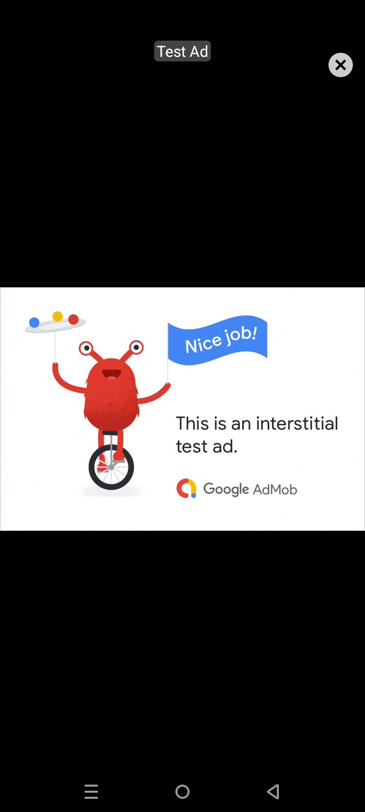

### 2. Rewarded Add Placement  (Optional - Assignment)
### What is a Rewarded Ad?

A rewarded ad (in Google AdMob) is a video ad that the user chooses to watch in exchange for something valuable in your app.

#### Key idea:

1. User taps “Watch Ad”
2. Watches video
3. Gets reward (coins, hints, unlocks)

It is user-controlled, so it feels less annoying than other ads.

#### Problem: Ad Conflict with Interstitial Ads

#### If you use:

1. Interstitial ads (automatic full screen)
2. Rewarded ads (user-triggered)

   They can conflict if:

Both try to show at the same time
Ads appear too frequently
User gets annoyed → uninstall App

### Implementation
Let's add it in NutritionAdvice Activity.

Inside NutritionAdvice Activity declare and initialize below variable Globally.


```kotlin
   var rewardedAd: RewardedAd? = null
```

Add below function to load a rewarded ad. Also change the AD Unt ID for rewarded ad.
Add this function after the onCreate() function.

```kotlin
fun loadRewardedAd(context: Context) {
    val adRequest = AdRequest.Builder().build()

    RewardedAd.load(context,
        "ca-app-pub-3940256099942544/5224354917",
        adRequest,
        object : RewardedAdLoadCallback() {

            override fun onAdLoaded(ad: RewardedAd) {
                rewardedAd = ad
            }

            override fun onAdFailedToLoad(error: LoadAdError) {
                rewardedAd = null
            }
        })
}

fun showRewardedAd(activity: Activity) {
   if (rewardedAd != null) {
      rewardedAd?.show(activity) { rewardItem ->
         // Give reward to user
         val rewardAmount = rewardItem.amount
         val rewardType = rewardItem.type

         println("User earned: $rewardAmount $rewardType")
      }
   } else {
      println("Ad not ready")
   }
}
```

Inside NutritionAdvice Activity, Inside onCreate() function, Call loadRewardedAd() function.
Then you can introduce a Button in Xml and use it to Trigger the showRewardedAd().
```kotlin
 setContentView(R.layout.activity_nutrition_advice)

//Load rewarded ads
loadRewardedAd(this)
//Show rewarded ad on Button Click
val reward = findViewById<Button>(R.id.reward)
reward.setOnClickListener{
   showRewardedAd(this)
}

```


Full Code NutritionAdvice.

```kotlin
package com.example.wellnessapp

import android.app.Activity
import android.content.Context
import android.os.Bundle
import android.widget.Button
import android.widget.Toast
import androidx.activity.enableEdgeToEdge
import androidx.appcompat.app.AppCompatActivity
import androidx.core.view.ViewCompat
import androidx.core.view.WindowInsetsCompat
import com.google.android.gms.ads.AdRequest
import com.google.android.gms.ads.LoadAdError
import com.google.android.gms.ads.rewarded.RewardedAd
import com.google.android.gms.ads.rewarded.RewardedAdLoadCallback

class NutritionAdvice : AppCompatActivity() {

    var rewardedAd: RewardedAd? = null

    override fun onCreate(savedInstanceState: Bundle?) {
        super.onCreate(savedInstanceState)
        enableEdgeToEdge()
        setContentView(R.layout.activity_nutrition_advice)
        //Load rewarded ads
        loadRewardedAd(this)
        //Show rewarded ad on Button Click
        val reward = findViewById<Button>(R.id.reward)
        reward.setOnClickListener{
            showRewardedAd(this)
        }

        ViewCompat.setOnApplyWindowInsetsListener(findViewById(R.id.main)) { v, insets ->
            val systemBars = insets.getInsets(WindowInsetsCompat.Type.systemBars())
            v.setPadding(systemBars.left, systemBars.top, systemBars.right, systemBars.bottom)
            insets
        }
    }


    fun loadRewardedAd(context: Context) {
        val adRequest = AdRequest.Builder().build()

        RewardedAd.load(context,
            "ca-app-pub-3940256099942544/5224354917",
            adRequest,
            object : RewardedAdLoadCallback() {

                override fun onAdLoaded(ad: RewardedAd) {
                    rewardedAd = ad
                }

                override fun onAdFailedToLoad(error: LoadAdError) {
                    rewardedAd = null
                }
            })
    }

    fun showRewardedAd(activity: Activity) {
        if (rewardedAd != null) {
            rewardedAd?.show(activity) { rewardItem ->
                // Give reward to user
                val rewardAmount = rewardItem.amount
                val rewardType = rewardItem.type

                println("User earned: $rewardAmount $rewardType")
                Toast.makeText(applicationContext, "Rewarded", Toast.LENGTH_SHORT).show()
                Toast.makeText(applicationContext, "Navigate a New Content Activity", Toast.LENGTH_SHORT).show()

            }
        } else {
            println("Ad not ready")
            Toast.makeText(applicationContext, "Not Rewarded", Toast.LENGTH_SHORT).show()
        }
    }
}
```

#### Run your app -> Make sure you are connected to the internet.

Click on NutritionAdvice Button from MainActivity, then press 'Watch and Get Rewarded' Button.

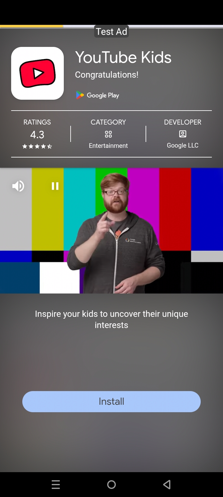
<br>
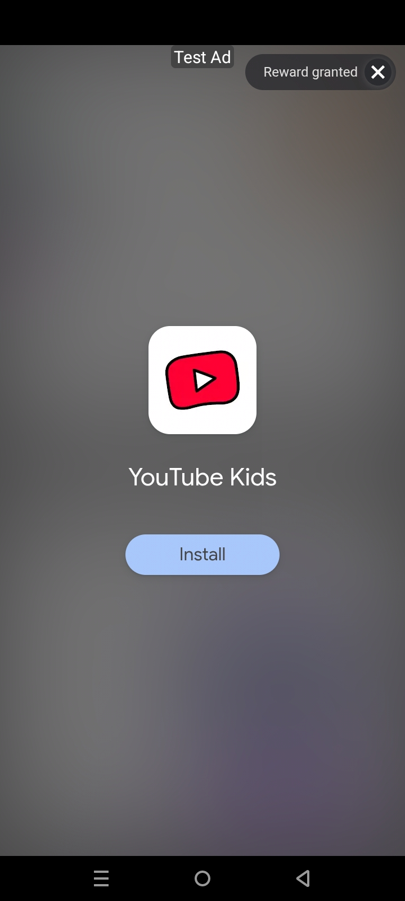


### How to Create Admob Account, Add App, Add App units etc
https://www.youtube.com/watch?v=zC075pcM7rc&list=PLcJhXDSkclw16you_lO2SnWlJF2fzUgwL&index=4

